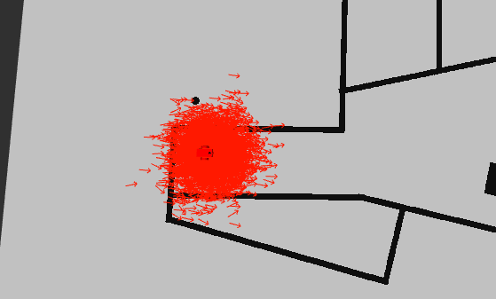
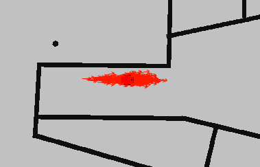
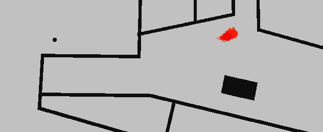

# WhereAmI
Project 3 of the Udacity Robotics Software Engineer Nanodegree Program.

# Overview
This project uses the ROS AMCL package to accurately localize a mobile robot inside a map in the Gazebo simulation environments.

# Getting Started
Prerequisites: ROS and Gazebo installed on Linux workspace

Dependencies:
```
$ sudo apt-get install ros-kinetic-navigation ros-kinetic-map-server ros-kinetic-move-base ros-kinetic-amcl libignition-math2-dev protobuf-compiler
```
Clone the repository, navigate to the root level directory, build the catkin files and launch gazebo world. 
```
$ catkin_make
$ source devel/setup.bash
$ roslaunch my_robot world.launch
```
Open a new terminal and launch the ```amcl``` node.
```
$ source devel/setup.bash
$ roslaunch my_robot amcl.launch
```
The robot can be operated through Rviz or through the teleop node. To operate the robot in Rviz, press the ```2D Nav Goal``` button in the toolbar, then click and drag on the map to send the goal to the robot. It will start moving and localize itself in the process.
To operate the robot using the ```teleop``` node, open a new terminal and launch the ```teleop``` script.
```
$ source devel/setup.bash
$ rosrun teleop_twist_keyboard teleop_twist_keyboard.py
```
The robot can now be controlled by keyboard commands.

# Localization Results
The amcl particles are located randomly around the initialized location, and converge to the actual position of the robot during the localization process. Videos of the localization process can be found in the images folder for [odometry noise of 0.1](images/localization1.mp4) and for [odomoetry noise of 0.2](images/localization2.mp4), with the localization result for the robot with odometry noise of 0.1 being more accurate.




Position of particles around robot before localization



Position of particles around robot during location



Position of particles converging at the robot's actual location after localization
